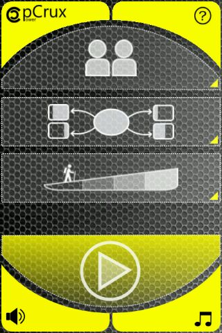
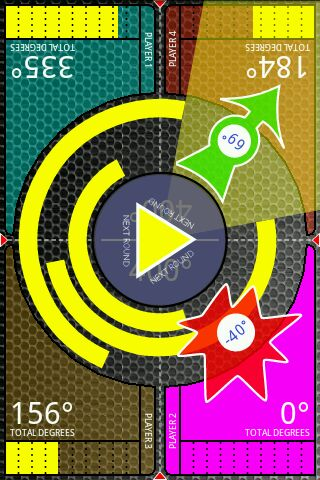
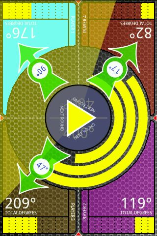
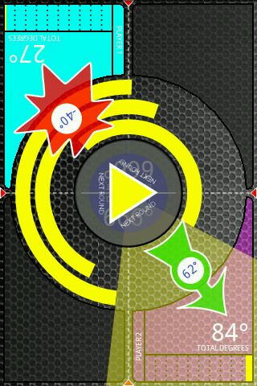
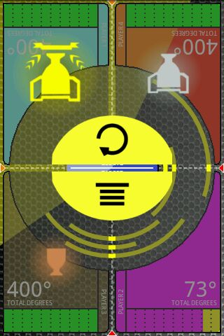

# pCrux
pCrux is simple multiplayer game for 2, 3 or 4 players on the same device. Game was developed back in 2012 for Android 4.4 (api level 19) using Eclipse  and ADT plugin. Latest compiled package is available in releases section.

# Google Play description
pCrux is simple, easy to understand, multiplayer game for 2, 3 or 4 players on the same device. Touch your area to stop slowing down arcs. Remember not the fastest but the smartest player wins! 

To gain as much degrees as possible stop it only when minimum portion of your area is shadowed by arcs.Challenge your family, friends or enemies to battle of tactics, reflexes and luck.

Two play modes are included:
- HitIT mode: First player, who reaches designated score, wins.
- CoolIT mode: When all available points are distributed between players, game is over. Player with the highest score wins.

Enjoy 2 player, 3 player or 4 player gaming experience on the same device.

# Screenshots

